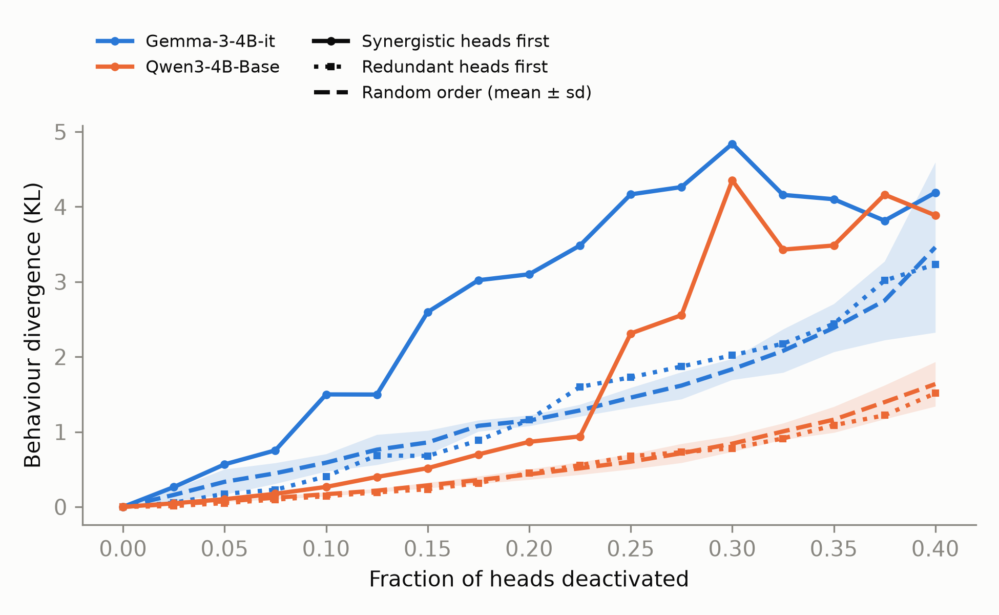

# Synergistic Cores in LLMs

Intelligence has evolved independently in biological and artificial systems. The latter offer a chance to study how and if the whole of the underlying neural network becomes more than the sum of its parts. Take the human visual system for example: one eye alone cannot encode three-dimensional structures yet their pairing enables us to perceive depth. This repo reproduces the results of [Urbina-Rodriguez 2026](https://arxiv.org/abs/2601.06851) by running a prompt catalogue aimed at different cognitive task categories on Gemma3 and Qwen3 and computing their synergy and redundancy scores on pairs of attention heads.

## Method

```
60 prompts (6 cognitive categories)
   → 100-token generation, recording ‖softmax(qKᵀ/√d)·V‖₂ for every head at every token
   → ΦID for every pair of heads (discrete, MMI): Syn→Syn = synergy, Red→Red = redundancy
   → per head: rank(synergy) − rank(redundancy), re-ranked to 1…N
   → mean rank per layer → "synergistic core" profile
```

Runs locally on an M1 Pro (16 GB, bf16 on MPS). Code in `src/syncore/`, 35 tests.

## Results so far

Middle layer of the network show synergistic cores per synergy-redundancy rank.


We compute each layer for N heads with activation $a_h(t) = \lVert \mathrm{softmax}(q_t K^\top/\sqrt{d}) V \rVert_2$ over 100 generated tokens:

```math
b_h(t) = \mathbb{1}\left[a_h(t) > \bar a_h\right] \qquad \text{(binarise each series at its mean)}
```

```math
\mathrm{syn}_{ij} = \big\langle \Phi\mathrm{ID}_{\mathrm{Syn}\to\mathrm{Syn}}(b_i, b_j) \big\rangle_{t,\ \mathrm{prompts}}, \qquad \mathrm{red}_{ij} = \big\langle \Phi\mathrm{ID}_{\mathrm{Red}\to\mathrm{Red}}(b_i, b_j) \big\rangle_{t,\ \mathrm{prompts}}
```

```math
S_h = \frac{1}{N-1}\sum_{j \neq h} \mathrm{syn}_{hj}, \qquad R_h = \frac{1}{N-1}\sum_{j \neq h} \mathrm{red}_{hj}, \qquad r_h = \mathrm{rank}\big(\mathrm{rank}(S_h) - \mathrm{rank}(R_h)\big)
```

```math
P_\ell = \frac{1}{|\ell|}\sum_{h \in \ell} r_h, \qquad \text{plotted: } \frac{P_\ell - \min_\ell P_\ell}{\max_\ell P_\ell - \min_\ell P_\ell}
```

ΦID uses MMI redundancy with a lag of one token. High values mean a layer's heads are predominantly synergistic, low values predominantly redundant.

Middle transformer layers are visible in the heatmaps.


### Ablating synergistic heads disrupts behaviour most



Heads are switched off (attention output set to zero) cumulatively in three orders: most synergistic first, most redundant first, or random (5 orders, mean ± sd). Behaviour divergence is the KL divergence between the intact and ablated model's next-token distributions, teacher-forced on the intact model's 100-token responses and averaged over tokens and the 60 prompts:

```math
D = \Big\langle \mathrm{KL}\big(p_{\text{intact}}(\cdot \mid x_{\lt t})  \big\Vert  p_{\text{ablated}}(\cdot \mid x_{\lt t})\big) \Big\rangle_{t,\ \mathrm{prompts}}
```

In both models, removing synergistic heads first is far more disruptive than removing random heads. With 30% of heads removed it is 2.6× random for Gemma (4.84 vs 1.84 ± 0.14) and 5.2× for Qwen (4.35 vs 0.84 ± 0.11). Removing redundant heads first tracks or stays below random.

## In progress

- Step 2b: MATH accuracy when adding noise to the top 25% synergistic vs redundant vs random heads (paper Fig 4b).

## Running

```bash
PYTHONPATH=src uv run python scripts/01_capture.py --model google/gemma-3-4b-it --out results/gemma [--no-chat]
PYTHONPATH=src uv run python scripts/02_phiid.py   --run results/gemma      # vectorised discrete ΦID, seconds
PYTHONPATH=src uv run python scripts/03_plots_step1.py
PYTHONPATH=src uv run python scripts/04_divergence.py --run results/gemma      # ablation, ~1 h per model
PYTHONPATH=src uv run python scripts/06_plot_fig4a.py
```

`PYTHONPATH=src` is needed because macOS hides the venv's `.pth` files and Python 3.13 skips hidden ones.
Spec and plan: `docs/superpowers/`. Exploration notes: `exploration/README.md`.

## Citation

This repo reproduces the paper below. ΦID is computed with [`phyid`](https://github.com/Imperial-MIND-lab/integrated-info-decomp), whose authors ask that the second and third works be cited.

```bibtex
@article{urbina2026synergistic,
  title   = {A Brain-like Synergistic Core in LLMs Drives Behaviour and Learning},
  author  = {Urbina-Rodriguez, Pedro and Fountas, Zafeirios and Rosas, Fernando E. and Wang, Jun and
             Luppi, Andrea I. and Bou-Ammar, Haitham and Shanahan, Murray and Mediano, Pedro A. M.},
  journal = {arXiv preprint arXiv:2601.06851},
  year    = {2026}
}

@article{mediano2025phiid,
  title   = {Toward a unified taxonomy of information dynamics via Integrated Information Decomposition},
  author  = {Mediano, Pedro A. M. and Rosas, Fernando E. and Luppi, Andrea I. and Carhart-Harris, Robin L. and
             Bor, Daniel and Seth, Anil K. and Barrett, Adam B.},
  journal = {Proceedings of the National Academy of Sciences},
  volume  = {122},
  number  = {39},
  pages   = {e2423297122},
  year    = {2025}
}

@article{luppi2022synergistic,
  title   = {A synergistic core for human brain evolution and cognition},
  author  = {Luppi, Andrea I. and Mediano, Pedro A. M. and Rosas, Fernando E. and Holland, Negin and
             Fryer, Tim D. and O'Brien, John T. and Rowe, James B. and Menon, David K. and Bor, Daniel and
             Stamatakis, Emmanuel A.},
  journal = {Nature Neuroscience},
  volume  = {25},
  number  = {6},
  pages   = {771--782},
  year    = {2022}
}
```

Models: [`google/gemma-3-4b-it`](https://huggingface.co/google/gemma-3-4b-it), [`Qwen/Qwen3-4B-Base`](https://huggingface.co/Qwen/Qwen3-4B-Base).
