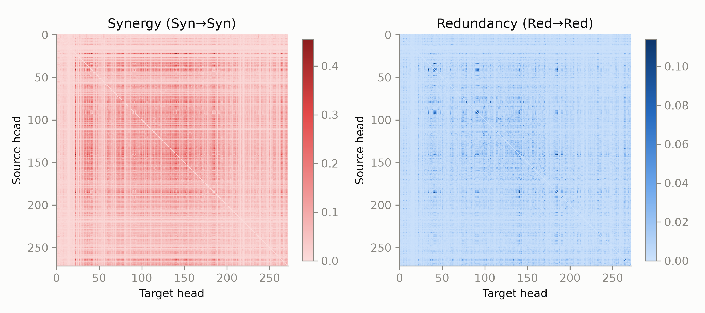
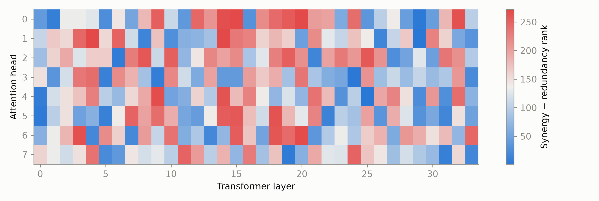

# Synergistic Cores in LLMs

Intelligence has evolved independently in biological and artifical systems. The latter offer a chance to study how and if the whole of the underlying electron network becomes more than the sum of its parts. Take the human visual system for example: one eye alone cannot encode three-dimensional structures yet their pariing enables us to perceive depth. This repo reproduces the results of [Urbina-Rodriguez 2026](https://arxiv.org/abs/2601.06851) by running a prompt catalogue aimed at different cognitive task categories on Gemma3 and Qwen3 and computing their synergy and redundancy scores on pairs of attention heads.

## Method

```
60 prompts (6 cognitive categories)
   → 100-token generation, recording ‖softmax(qKᵀ/√d)·V‖₂ for every head at every token
   → ΦID for every pair of heads (Gaussian, MMI): Syn→Syn = synergy, Red→Red = redundancy
   → per head: rank(synergy) − rank(redundancy), re-ranked to 1…N
   → mean rank per layer → "synergistic core" profile
```

Runs locally on an M1 Pro (16 GB, bf16 on MPS). Code in `src/syncore/`, 35 tests.

## Results so far

| Synergy vs redundancy between heads (Gemma-3-4B-it) | Synergy–redundancy rank per head |
|---|---|
|  |  |


- **Gemma-3-4B-it** reproduces the broad inverted U: low early layers, a synergistic middle, low late layers.
  It matches the paper's curve when smoothed (r ≈ 0.7) but not layer by layer (r ≈ 0.4).
- **Noise:** synergy and redundancy correlate at r ≈ 0.8 across heads, so their rank difference is a noisy
  residual. Two halves of the prompts agree at r ≈ 0.75.
- **Ruled out** as causes of the gap: per-layer averaging, pooled vs per-prompt ΦID, greedy vs sampled decoding,
  rank-then-average.
- **Random-init** Gemma lacks the late-layer redundancy, so that part of the structure is learned.

## In progress

- Plain-prompt (no chat template) runs for Gemma-3-4B-it and Qwen3-4B-Base. Base models degenerate under a chat template.
- Step 2: ablating synergistic vs redundant heads (behaviour divergence, MATH accuracy).

## Running

```bash
PYTHONPATH=src uv run python scripts/01_capture.py --model google/gemma-3-4b-it --out results/gemma [--no-chat]
PYTHONPATH=src uv run python scripts/02_phiid.py   --run results/gemma      # vectorised ΦID, seconds
PYTHONPATH=src uv run python scripts/03_plots_step1.py
```

`PYTHONPATH=src` is needed because macOS hides the venv's `.pth` files and Python 3.13 skips hidden ones.
Spec and plan: `docs/superpowers/`. Exploration notes: `exploration/README.md`.
