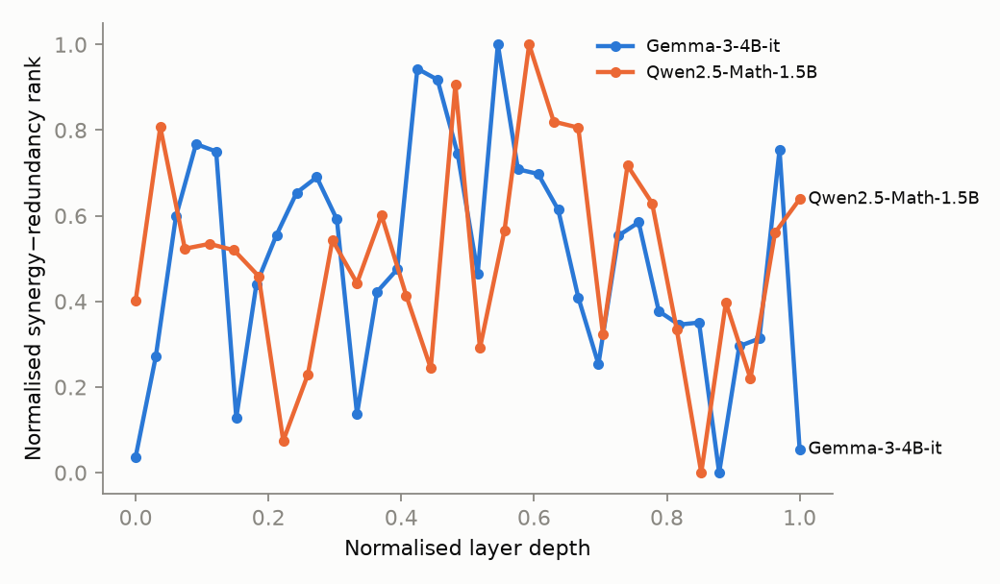
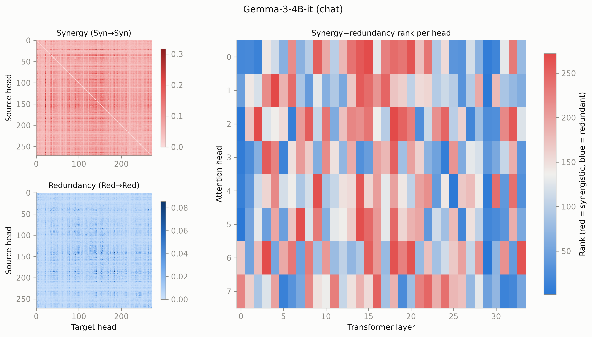
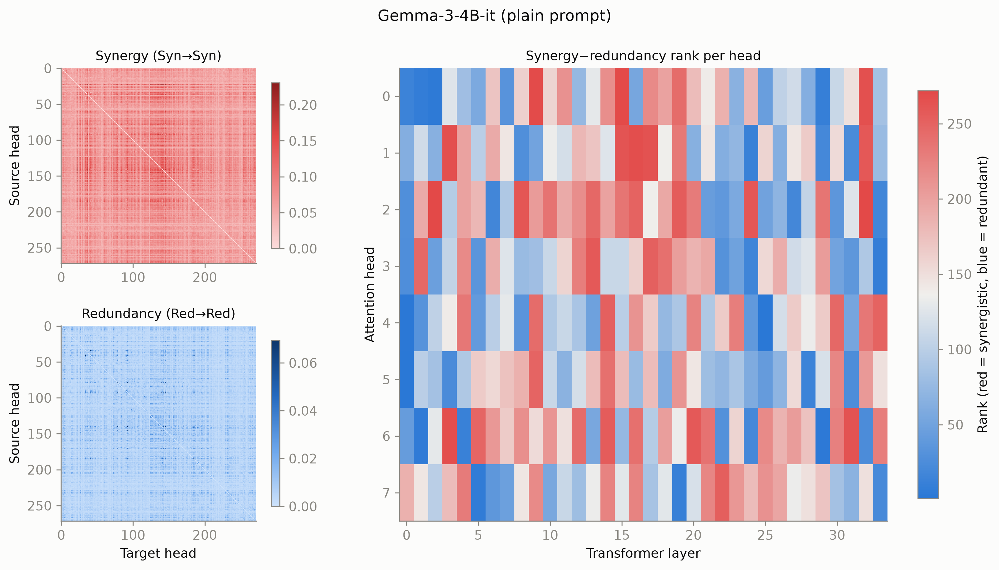
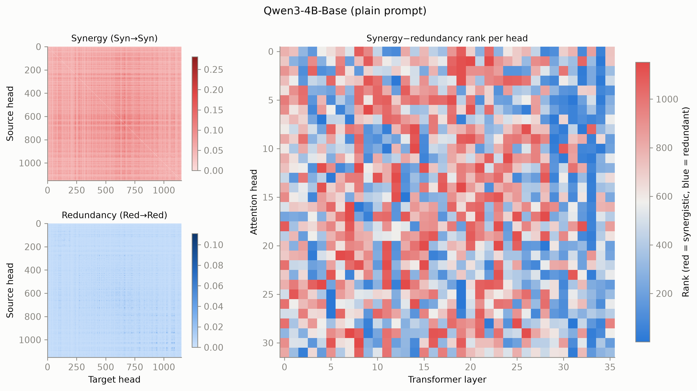

# Synergistic Cores in LLMs

Intelligence has evolved independently in biological and artificial systems. The latter offer a chance to study how and if the whole of the underlying neural network becomes more than the sum of its parts. Take the human visual system for example: one eye alone cannot encode three-dimensional structures yet their pairing enables us to perceive depth. This repo reproduces the results of [Urbina-Rodriguez 2026](https://arxiv.org/abs/2601.06851) by running a prompt catalogue aimed at different cognitive task categories on Gemma3 and Qwen3 and computing their synergy and redundancy scores on pairs of attention heads.

## Method

```
60 prompts (6 cognitive categories)
   → 100-token generation, recording ‖softmax(qKᵀ/√d)·V‖₂ for every head at every token
   → ΦID for every pair of heads (discrete, MMI): Syn→Syn = synergy, Red→Red = redundancy
   → per head: rank(synergy) − rank(redundancy), re-ranked to 1…N
   → mean rank per layer → "synergistic core" profile
```

Runs locally on an M1 Pro (16 GB, bf16 on MPS). Code in `src/syncore/`, 35 tests.

## Results so far

Middle layer of the network show synergistic cores per synergy-redundancy rank.


We compute each layer for N heads with activation $a_h(t) = \lVert \mathrm{softmax}(q_t K^\top/\sqrt{d})\,V \rVert_2$ over 100 generated tokens:

$$b_h(t) = \mathbb{1}\left[a_h(t) > \bar a_h\right] \qquad \text{(binarise each series at its mean)}$$

$$\mathrm{syn}_{ij} = \big\langle \Phi\mathrm{ID}_{\mathrm{Syn}\to\mathrm{Syn}}(b_i, b_j) \big\rangle_{t,\ \mathrm{prompts}}, \qquad \mathrm{red}_{ij} = \big\langle \Phi\mathrm{ID}_{\mathrm{Red}\to\mathrm{Red}}(b_i, b_j) \big\rangle_{t,\ \mathrm{prompts}}$$

$$S_h = \frac{1}{N-1}\sum_{j \neq h} \mathrm{syn}_{hj}, \qquad R_h = \frac{1}{N-1}\sum_{j \neq h} \mathrm{red}_{hj}, \qquad r_h = \mathrm{rank}\big(\mathrm{rank}(S_h) - \mathrm{rank}(R_h)\big)$$

$$P_\ell = \frac{1}{|\ell|}\sum_{h \in \ell} r_h, \qquad \text{plotted: } \frac{P_\ell - \min_\ell P_\ell}{\max_\ell P_\ell - \min_\ell P_\ell}$$

ΦID uses MMI redundancy with a lag of one token. High values mean a layer's heads are predominantly synergistic, low values predominantly redundant.

Middle transformer layers are visible in the heatmaps.





## In progress

- Step 2: ablating synergistic vs redundant heads (behaviour divergence, MATH accuracy).

## Running

```bash
PYTHONPATH=src uv run python scripts/01_capture.py --model google/gemma-3-4b-it --out results/gemma [--no-chat]
PYTHONPATH=src uv run python scripts/02_phiid.py   --run results/gemma      # vectorised discrete ΦID, seconds
PYTHONPATH=src uv run python scripts/03_plots_step1.py
```

`PYTHONPATH=src` is needed because macOS hides the venv's `.pth` files and Python 3.13 skips hidden ones.
Spec and plan: `docs/superpowers/`. Exploration notes: `exploration/README.md`.
